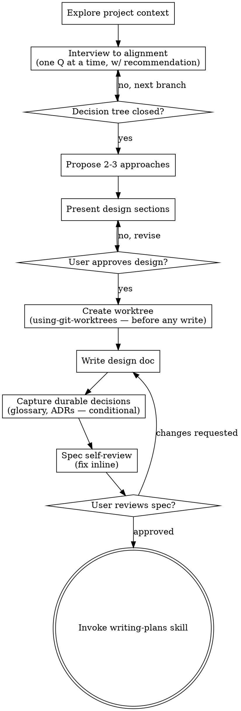

# Brainstorming Ideas Into Designs

Help turn ideas into fully formed designs and specs through natural collaborative dialogue.

Start by understanding the current project context, then interview the user one question at a time to refine the idea — each question carrying your recommended answer. Once you share one mental model of what you're building, present the design, get approval, and write it up as a spec, capturing any durable decisions (glossary terms, ADRs) alongside it.

<HARD-GATE>
Do NOT invoke any implementation skill, write any code, scaffold any project, or take any implementation action until you have presented a design and the user has approved it. This applies to EVERY project regardless of perceived simplicity.
</HARD-GATE>

## Anti-Pattern: "This Is Too Simple To Need A Design"

Every project goes through this process. A todo list, a single-function utility, a config change — all of them. "Simple" projects are where unexamined assumptions cause the most wasted work. The design can be short (a few sentences for truly simple projects), but you MUST present it and get approval.

Conversely, don't inflate a simple change with ceremony it doesn't need: the spec backbone scales down to a few bullets, and the glossary/ADR steps are conditional. A trivial change won't surface a term worth canonicalizing or a decision worth an ADR — so you skip them. See "Capture durable decisions" below.

## Checklist

You MUST create a task for each of these items and complete them in order. Items marked *(conditional)* are skipped when nothing qualifies — don't manufacture work to fill them:

1. **Explore project context** — files, docs, recent commits; note the existing ADRs (`docs/adr/`) and glossary (`GLOSSARY.md`, or wherever the project keeps its terms)
2. **Offer the visual companion just-in-time** — NOT upfront. The first time a question would genuinely be clearer shown than described, offer it then (its own message); on approval its browser tab opens for you. If no visual question ever arises, never offer it. See the Visual Companion section below.
3. **Interview to alignment** — clarifying questions one at a time, each with your recommended answer; walk the decision tree in dependency order; sharpen terminology as you go. See `grilling.md`.
4. **Propose 2-3 approaches** — with trade-offs, a rough effort size, and your recommendation
5. **Present design** — in sections scaled to their complexity, get user approval after each section. For integration-heavy designs, falsify load-bearing claims *before* approval (see *Falsify load-bearing claims before they harden*) — don't present a design resting on undischarged external-behavior assumptions.
6. **Create isolated workspace** — now that the design is approved and the branch name is settled, invoke the using-git-worktrees skill BEFORE writing any file. Every write from here on (spec, glossary, ADRs, plan, code) lands inside the worktree. Steps 1–5 are pure dialogue and stay in the current checkout; the first file write is step 7, and it must happen in the worktree.
7. **Write design doc** — save to `docs/superpowers/specs/YYYY-MM-DD-<topic>-design.md` using the backbone in `spec-format.md`, and commit
8. **Capture durable decisions** *(conditional)* — update `GLOSSARY.md` for any term that needed canonicalizing; record an ADR for any decision meeting all three criteria, deduped against existing ADRs. See `GLOSSARY-FORMAT.md` and `ADR-FORMAT.md`.
9. **Spec self-review** — quick inline check for placeholders, contradictions, ambiguity, scope (see below)
10. **User reviews written spec** — ask the user to review the spec (and any ADRs/glossary changes) before proceeding
11. **Transition to implementation** — invoke writing-plans skill to create implementation plan

## Process Flow

**The terminal state is invoking writing-plans.** Do NOT invoke frontend-design, mcp-builder, or any other implementation skill. The ONLY skill you invoke after brainstorming is writing-plans.

## The Process

**Understanding the idea:**

- Check out the current project state first (files, docs, recent commits), including how the project already names things and what decisions it has already recorded.
- Before asking detailed questions, assess scope: if the request describes multiple independent subsystems (e.g., "build a platform with chat, file storage, billing, and analytics"), flag this immediately. Don't spend questions refining details of a project that needs to be decomposed first.
- If the project is too large for a single spec, help the user decompose into sub-projects: what are the independent pieces, how do they relate, what order should they be built? Then brainstorm the first sub-project through the normal design flow. Each sub-project gets its own spec → plan → implementation cycle.
- For appropriately-scoped projects, interview one question at a time to refine the idea.

**Interviewing — this is a grill, not a survey:**

The clarifying-questions phase decides whether the design rests on a shared model or on hidden assumptions. Keep the focus on purpose, constraints, and success criteria, and run it with three disciplines (full detail in `grilling.md`):

- **Map the decision tree first, silently**, and ask the root questions before the leaves — answers to upstream decisions prune the downstream ones.
- **Carry a recommendation on every question**, with a one-line reason. The user confirms, overrides, or redirects — they shouldn't have to generate answers from scratch.
- **Check the code before you ask.** If the repo already answers a question, cite it instead of asking. Prefer the project's semantic/code-graph tools if it has them; else an explore subagent or grep/read.

Ask one question per message, wait, absorb the answer (cross off or open branches), then ask the next — in dependency order. Prefer multiple-choice when the user is picking from a known set. Sharpen fuzzy terms into canonical ones as you go and lock each resolved definition in your notes — but **defer the `GLOSSARY.md` file write to step 8** (after the worktree exists), since the interview runs before the workspace is created. Stop when every open decision is deferred or out of scope and nothing left would materially change the design.

**Exploring approaches:**

- Propose 2-3 different approaches with trade-offs. For each, name the cost and the benefit in one line each, plus a rough effort size (S / M / L / XL).
- Lead with your recommended option and explain why — and say what evidence would change your recommendation.

**Presenting the design:**

- Once you share one model of what you're building, present the design.
- Scale each section to its complexity: a few sentences if straightforward, up to 200-300 words if nuanced.
- Ask after each section whether it looks right so far.
- Cover the spec backbone (what / why / scope / non-goals / acceptance criteria) plus the design shape (architecture, components, data flow, error handling, testing) — see `spec-format.md`. Be ready to go back and clarify if something doesn't make sense.

**Design for isolation and clarity:**

- Break the system into smaller units that each have one clear purpose, communicate through well-defined interfaces, and can be understood and tested independently
- For each unit, you should be able to answer: what does it do, how do you use it, and what does it depend on?
- Can someone understand what a unit does without reading its internals? Can you change the internals without breaking consumers? If not, the boundaries need work.
- Smaller, well-bounded units are also easier for you to work with - you reason better about code you can hold in context at once, and your edits are more reliable when files are focused. When a file grows large, that's often a signal that it's doing too much.

**Working in existing codebases:**

- Explore the current structure before proposing changes. Follow existing patterns.
- Where existing code has problems that affect the work (e.g., a file that's grown too large, unclear boundaries, tangled responsibilities), include targeted improvements as part of the design - the way a good developer improves code they're working in.
- Don't propose unrelated refactoring. Stay focused on what serves the current goal.

## Falsify load-bearing claims before they harden

A design generates claims faster than it checks them, and an unchecked claim that gets built on is the most expensive error there is — because **review can't catch it**: a reviewer reasoning about plausible prose reaches the same wrong conclusion the author did. So don't defer these to review or to implementation. **Match each claim to the one thing that falsifies it, and do that now, in the design.**

| A claim you're about to write as fact… | …is falsified only by |
|---|---|
| **How an external system / tool / platform behaves** — "X accepts a fine-grained token", "the test harness no-ops this import", "this third-party action runs in our setup", "this flag bumps the version" | **Reading the authoritative doc or source**, or a 5-minute spike. Cite it (`URL` or `path:line`). Corpus memory is stale and generic — it does not count as verification. |
| **A gate / conditional / invariant** — "if X drifts, the check fails" | **Tracing the concrete failure scenario**: walk the exact path where it *should* fire and confirm it does. (Real case: a gate comparing a branch tip to itself — always equal, never fired, and a reviewer waved it through.) |
| **A fact about this repo** — "there's no such guard", "nothing else reads this" | **grep / read it.** Never assert the codebase's current state from memory. |
| **That you've listed every surface** — public URLs, env vars, ingress, credentials | **Enumerate from the authoritative source** (the schema, every typed boundary value, every browser/external-initiated call), not the obvious subset — and cross-reference ground truth that already lists them (a CORS block, a config file, an `.env` schema). |
| **That it works on the first run** — a required check, a channel/moving tag, a generated secret, the first build or release | **Ask "what's the very first run, *before* this thing exists?"** Cold-start is a separate path; if you can't describe it, you haven't designed it. |

Capture the external-behavior and fact claims you can't fully discharge in the design as a short **Boundary assumptions** block (*claim · how it'll be verified · status*) so the plan can spike them before building on them. **Nothing ships as "assumed."**

**Proportionality — when this applies.** This is for designs that touch **external systems, no-oracle surfaces (CI / release / infra-as-config), or stateful bootstrap** — where defects hide because nothing executable proves them. A pure application-logic change covered by tests needs none of it: the test *is* the falsifier. Don't manufacture a register for a button. Scale the rigor to the integration-surface density, not the feature size.

## After the Design

**Create the workspace first (before any file write):**

- The design is approved, so the branch name is now settled — invoke the using-git-worktrees skill to create the isolated workspace.
- This MUST happen before the spec, glossary, ADRs, or any other file is written, so the entire feature loop lands inside the worktree (and on its branch), never in the current checkout.
- If you're already in an isolated workspace (using-git-worktrees Step 0 detects this), it's a no-op — proceed.

**Documentation:**

- Write the validated design (spec) to `docs/superpowers/specs/YYYY-MM-DD-<topic>-design.md`, using the backbone in `spec-format.md`
  - (User preferences for spec location override this default)
- Use elements-of-style:writing-clearly-and-concisely skill if available
- Commit the design document to git

**Capture durable decisions (conditional):**

The spec is per-task. Two project-level artifacts outlive it, and the interview usually surfaces material for them. Don't re-state a decision in all three — each has one job (`spec-format.md` has the division-of-labor table):

- **Glossary** — when the interview pinned down a term (resolved an overloaded word, picked a canonical name over alternatives), record it in `GLOSSARY.md`. Terminology only, no behavior. If the project keeps its glossary somewhere else (a README, an AGENTS/CLAUDE file), offer to consolidate into `GLOSSARY.md` and leave a cross-reference, rather than maintaining two. See `GLOSSARY-FORMAT.md`.
- **ADRs** — when the interview settled a decision that is hard to reverse, surprising without context, AND the result of a real trade-off (all three), record an ADR in `docs/adr/`. First read the existing ADRs and match them against the decisions the session surfaced — write only the genuine gaps; never duplicate a recorded decision (supersede it if you're revising it). See `ADR-FORMAT.md`.

Most sessions produce a few glossary terms and zero-to-two ADRs. A trivial change produces neither — that's expected; skip the step.

**Spec Self-Review:**
After writing the spec document, look at it with fresh eyes:

1. **Placeholder scan:** Any "TBD", "TODO", incomplete sections, or vague requirements? Fix them.
2. **Internal consistency:** Do any sections contradict each other? Does the architecture match the feature descriptions?
3. **Scope check:** Is this focused enough for a single implementation plan, or does it need decomposition?
4. **Ambiguity check:** Could any requirement be interpreted two different ways? If so, pick one and make it explicit.
5. **Claims discharged (integration-heavy designs):** Does any load-bearing claim about an external system, a gate's behavior, or the repo's state still rest on memory? Each should be cited (doc/source), traced (failure scenario), grepped, or listed in the Boundary-assumptions block for the plan to spike. An internal-consistency pass won't catch a confidently-wrong external claim — that's why this is a separate check.

Fix any issues inline. This is your first pass — the independent spec review below is the gate.

**Independent Spec Review:**
Your self-review is the author checking their own work; it misses your blind spots. Before the user gate, dispatch a fresh **read-only** reviewer — writing stays with you, the reviewer only reads and reports:

- **In-model** — fill [spec-document-reviewer-prompt.md](spec-document-reviewer-prompt.md) and dispatch a `general-purpose` subagent with the spec path, on a model scaled to the spec's size.
- **Cross-model (optional, strongest)** — also run a Codex adversarial pass over the spec: the `codex-review` script with `--kind spec --file <spec>`, per [../requesting-code-review/codex-adversarial-review.md](../requesting-code-review/codex-adversarial-review.md). A different model breaks the blind spots a same-model reviewer shares. It needs only the `codex` CLI on PATH (no plugin), and degrades to a skip when absent.

Consolidate the findings yourself, per superpowers:receiving-code-review: fix the real issues (a finding both reviewers raise is high-signal), push back on the wrong ones, and re-review after fixes until clean. For a trivial change the in-model pass alone is enough, and a change that produced no spec worth reviewing may skip it — say so.

**User Review Gate:**
After the spec review loop passes, ask the user to review the written spec before proceeding:

> "Spec written and committed to `<path>` (plus `<N>` ADR(s) and glossary updates, if any). Please review it and let me know if you want to make any changes before we start writing out the implementation plan."

Wait for the user's response. If they request changes, make them and re-run the spec review loop. Only proceed once the user approves.

**Implementation:**

- Invoke the writing-plans skill to create a detailed implementation plan
- Do NOT invoke any other skill. writing-plans is the next step.

## Key Principles

- **One question at a time** - Don't overwhelm with multiple questions
- **Always recommend an answer** - Every question carries your pick and a one-line reason; the user confirms or redirects
- **Code before question** - Don't ask what the repo already answers; find it and cite it
- **Falsify, don't assert** - A claim about an external system, a gate, or the repo's state is verified by docs/source, a traced failure scenario, or a grep — never by confidence. Match the claim to its falsifier and do it in the design (integration-heavy work; see the section above)
- **Resolve the decision tree in dependency order** - Root decisions before the leaves they constrain
- **Multiple choice preferred** - Easier to answer than open-ended when possible
- **YAGNI ruthlessly** - Remove unnecessary features from all designs
- **Explore alternatives** - Always propose 2-3 approaches before settling
- **Incremental validation** - Present design, get approval before moving on
- **Name things once** - Sharpen terms into the glossary; record load-bearing decisions as ADRs; don't let the same concept drift across docs
- **Be flexible** - Go back and clarify when something doesn't make sense

## Visual Companion

A browser-based companion for showing mockups, diagrams, and visual options during brainstorming. Available as a tool — not a mode. Accepting the companion means it's available for questions that benefit from visual treatment; it does NOT mean every question goes through the browser.

**Offering the companion (just-in-time):** Do NOT offer it upfront. Wait until a question would genuinely be clearer shown than told — a real mockup / layout / diagram question, not merely a UI *topic*. The first time that happens, offer it then, as its own message:
> "This next part might be easier if I show you — I can put together mockups, diagrams, and comparisons in a browser tab as we go. It's still new and can be token-intensive. Want me to? I'll open it for you."

**This offer MUST be its own message.** Only the offer — no clarifying question, summary, or other content. Wait for the user's response. If they accept, start the server with `--open` so their browser opens to the first screen automatically. If they decline, continue text-only and don't offer again unless they raise it.

**Per-question decision:** Even after the user accepts, decide FOR EACH QUESTION whether to use the browser or the terminal. The test: **would the user understand this better by seeing it than reading it?**

- **Use the browser** for content that IS visual — mockups, wireframes, layout comparisons, architecture diagrams, side-by-side visual designs
- **Use the terminal** for content that is text — requirements questions, conceptual choices, tradeoff lists, A/B/C/D text options, scope decisions

A question about a UI topic is not automatically a visual question. "What does personality mean in this context?" is a conceptual question — use the terminal. "Which wizard layout works better?" is a visual question — use the browser.

If they agree to the companion, read the detailed guide in `visual-companion.md` (in this directory) before proceeding.
